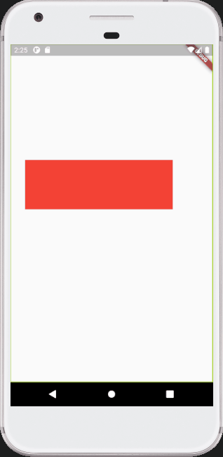
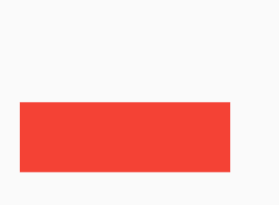

# Flutter context menu

An implementation of a context menu. It can be displayed on top of the widget, below the widget, or at the position of the finger tap.



### Example usage
```dart
class _MyHomePageState extends State<MyHomePage> {
  ContextMenu menu;

  _MyHomePageState() {
    Map<String, Map> data = {
      "item1": {"icon": Icons.edit, "func": showData},
      "item2": {"icon": Icons.edit, "func": showData}
    };
    menu = ContextMenu(data);
  }

  @override
  Widget build(BuildContext context) {
    return Scaffold(
      body: SafeArea(
        child: Stack(
          children: [
            Container(
              margin: EdgeInsets.only(top: 210, left: 30),
              child: GestureDetector(
                  onTapDown: (details) {
                    menu.getWidgetPosition(details);
                  },
                  onLongPress: () {
                    menu.showMenuAtFingerPosition(key);
                  },
                  onTap: () => menu.hideMenu(),
                  child: Container(
                      key: key, color: Colors.red, height: 100, width: 300)),
            ),
            menu
          ],
        ),
      ),
    );
  }
}
```

The menu enttries are in the form of a dictionary
```
Map data = {
    "menu_name": {
        "icon": //An IconData icon
        "func": //A reference to the function
    },
    ...other menu items
}
```

</br>

#### Before displaying the menu
The ```getWidgetPosition(tapdowndetails)``` has to be called on the GestureDetector onTapDown callback and the ```menu.hideMenu()``` method has to be called on the GetstureDetector onTap callback.

### Display options
1. To show the menu above the widget, call the ```showMenuAboveWidget(wigetKey)``` on the ContextMenu object in the GestureDetector(or equivaluent's) onLongPress callback
```
GestureDetector(
    ...
    onLongPress: () {
        menu.showMenuAtFingerPosition(key);
    },
    ...
    child: Container(
        key: key, color: Colors.red, height: 100, width: 300)
),
```



2. To display the menu at the point of contact on the widget, call ```showMenuAtFingerPosition(widgetKey)``` on the ContextMenu object in the GestureDetector(or equivaluent's) onLongPress callback
```
GestureDetector(
    ...
    onLongPress: () {
        menu.showMenuAtFingerPosition(key);
    },
    ...
    child: Container(
        key: key, color: Colors.red, height: 100, width: 300)
),
```


